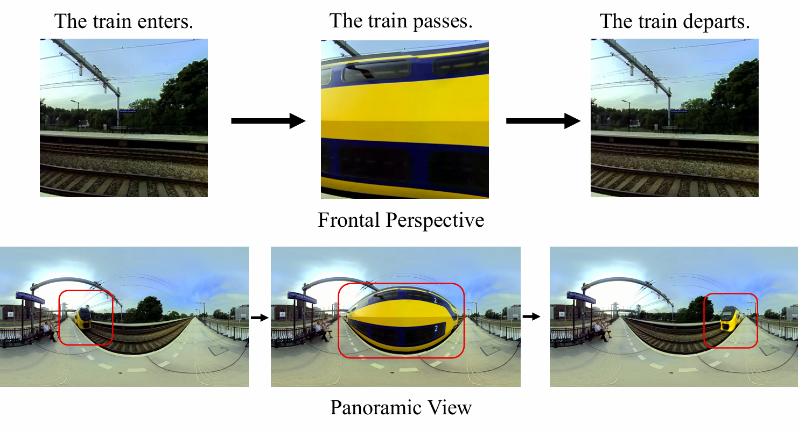
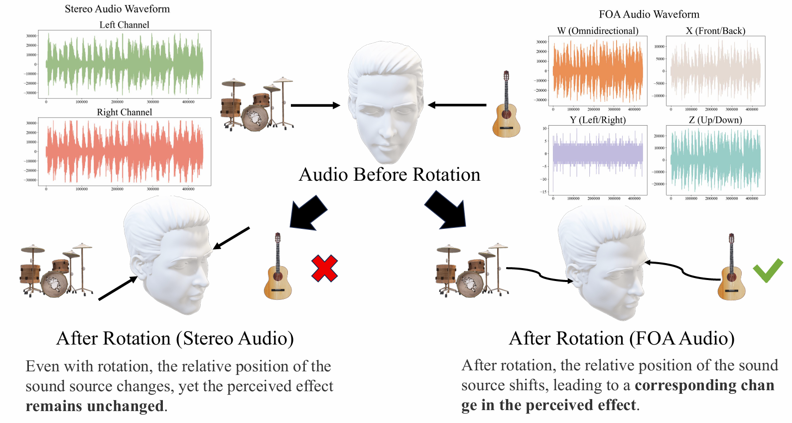
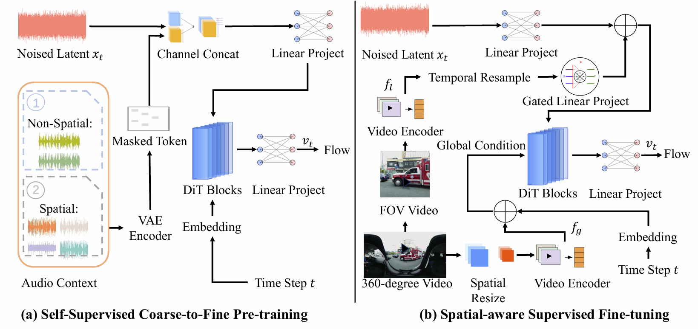

# 🎧 OmniAudio: Generating Spatial Audio from 360-Degree Video


<p align="center"> If you find this project useful, a star ⭐ on GitHub would be greatly appreciated! </p>

<p align="center">  
<a href="https://arxiv.org/pdf/2504.14906"> Read the paper</a> |  
<a href="https://OmniAudio-360v2sa.github.io/">🌐 Online Demo</a>  
</p>  


**demo-video** 

<div align="center"><video src="assets/demo.mp4" width="800"></div>

---
## 🗞️ News

* **\[2025.02]** 🔥 [Online Demo](https://OmniAudio-360v2sa.github.io/) is live — try it now!
* **\[2025.04]** 🔥 [OmniAudio paper](https://arxiv.org/pdf/2504.14906) is released on arXiv.
* **\[2025.05]** 🔥 Released inference code and OmniAudio dataset.

---

✨🔊 Transform your 360-degree videos into immersive spatial audio! 🌍🎶 

   

PyTorch Implementation of **OmniAudio**, a model for generating spatial audio from 360-degree videos.  

Due to anonymization requirements, **our model will be available on Hugging Face soon！** 

---

## 🧠 Model Architecture & Demo  

The overall architecture of OmniAudio is shown below:  

  

Curious about the results? 🎧🌐  
👉 **[Try our demo page here!](https://OmniAudio-360v2sa.github.io/)**  

---

## 🎬 Quick Start  
We provide an example of how you can perform inference using OmniAudio.  

### 🏃 Inference with Pretrained Model  
To run inference, follow these steps:  

1️⃣ **Navigate to the root directory.** 📂  
2️⃣ **Create the Inference Environment.**  

To set up the environment, ensure you have **Python >= 3.8.20** installed. Then, run the following commands:  

```bash
pip install -r requirements.txt
pip install git+https://github.com/patrick-kidger/torchcubicspline.git
```
 
3️⃣ **Run inference with the provided script:**  
   ```bash
   bash demo.sh video_path checkpoint_dir cuda_id
   ```  
💡 *You can also modify `demo.sh` to change the output directory.* The `cases` folder contains some sample 360-degree videos in the equirectangular format—make sure your videos follow the same format! 🎥✨  

---


## 📦 Dataset: Sphere360

We provide **Sphere360**, a large-scale, high-quality dataset of paired 360-degree video and spatial audio clips, specifically curated to support training and evaluation of spatial audio generation models like OmniAudio.

The dataset includes:

* **Over 103,000** 10-second clips
* **288 hours** of total spatial content
* Paired **equirectangular 360-degree video** and **first-order ambisonics (FOA)** 4-channel audio (W, X, Y, Z)

### 📁 Access and Structure

To explore or use the dataset, follow these steps:

1️⃣ **Navigate to the dataset folder**:

```bash
cd Sphere360
```

2️⃣ **Refer to the detailed usage guide** in the README file:
📖 [Sphere360 Dataset README](Sphere360/README.md)

Inside the directory, you’ll find:

* `dataset/`: contains split configurations, metadata, and channel information
* `toolset/`: crawling and cleaning tools for dataset construction
* `docs/`: figures and documentation describing the pipeline

---

### 🔀 Dataset Split

The dataset is split as follows (see `dataset/split/`):

* **Training set**: \~100.5k samples
* **Test set**: \~3k samples
* **Each sample**: 10 seconds of paired video and audio

---

### 🛠️ Data Collection & Cleaning

The dataset was constructed via a two-stage crawling and filtering pipeline:

* **Crawling**

  * Uses the [YouTube API](https://developers.google.com/youtube/v3/)
  * Retrieves videos by channel and keyword-based queries
  * Employs `yt-dlp` and `FFmpeg` to download and process audio/video streams
  * Details: [docs/crawl.md](Sphere360/docs/crawl.md)

* **Cleaning**

  * Filters out content using the following criteria:

    * **Silent audio**
    * **Static frames**
    * **Audio-visual mismatches**
    * **Human voice presence**
  * Relies on models like [ImageBind](https://github.com/facebookresearch/ImageBind) and [SenseVoice](https://github.com/FunAudioLLM/SenseVoice)
  * Details: [docs/clean.md](Sphere360/docs/clean.md)

---

### ⚠️ Legal Notice & Licensing

* All videos are collected from YouTube under terms consistent with fair use for academic research.
* Videos under Creative Commons licenses are properly attributed.
* No video is used for commercial purposes.
* All channel metadata is recorded in `dataset/channels.csv`.


---

💡 *Have fun experimenting with OmniAudio! 🛠️💖*


