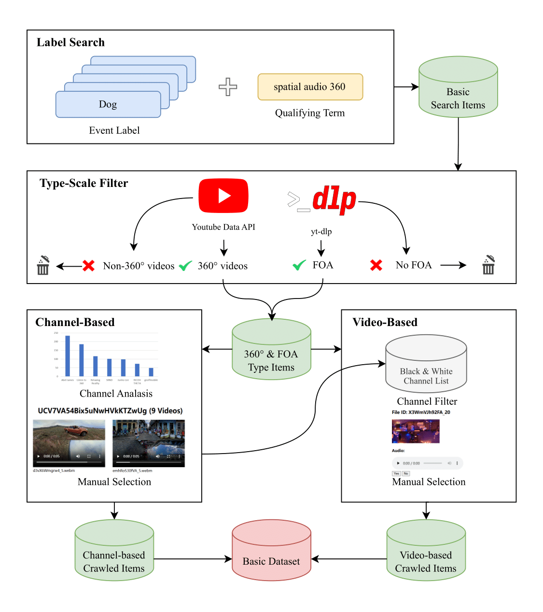

# Sphere360

Sphere360 is a comprehensive dataset of paired 360-degree videos and spatial audio content sourced from YouTube. The collection contains over 103,000 matched 360-degree video and audio clips, representing a total of 288 hours of immersive content. This repository includes both the curated dataset and the essential web crawling and data processing tools used for its compilation.


- [Sphere360](#sphere360)
  - [Copyright](#copyright)
  - [Dataset Split](#dataset-split)
  - [Toolset Environment](#toolset-environment)
      - [Python Environment](#python-environment)
      - [YouTube API](#youtube-api)
      - [FFmpeg](#ffmpeg)
      - [yt-dlp (Optional)](#yt-dlp-optional)
  - [Data Crawling](#data-crawling)
  - [Data Cleaning](#data-cleaning)
  - [Acknowledgments](#acknowledgments)
    - [Data Sources](#data-sources)
    - [Data Cleaning Dependencies](#data-cleaning-dependencies)


## Copyright

The video data utilized in this study were sourced from the YouTube platform. All content is copyrighted by their respective creators and owners. The videos included in this research adhere to YouTube's terms of service and, where applicable, to Creative Commons licenses. Specifically, videos under the Creative Commons license have been appropriately attributed to the original authors in accordance with the license terms (CC BY 4.0).

For videos not governed by a Creative Commons license, we acknowledge that they are protected by copyright and are used exclusively for academic research purposes. No commercial use of these videos or content is intended. The use of these videos falls under the fair use doctrine for educational and research purposes, as permitted by copyright law.

All channel information contained in the dataset is recorded in `dataset/channels.csv`.

## Dataset Split

The dataset split configuration can be found in the `dataset/split` directory, containing:

- Training set: ~100.5k samples
- Test set: ~3k samples
- Each sample duration: 10 seconds


## Toolset Environment

#### Python Environment

**Data Crawling:**

- Python Version: 3.10
- Requirements: [toolset/crawl/requirements.txt](toolset/crawl/requirements.txt)

**Data Cleaning:**

- Python Version: 3.10
- Requirements: [toolset/clean/requirements.txt](toolset/clean/requirements.txt)

#### YouTube API

1. Apply for a [YouTube API](https://developers.google.com/youtube/v3/) Key from Google Cloud Console
2. Insert the obtained key into:
    ```python
    # Location: toolset/crawl/core/build.py
    __API_KEY = "YOUR_YOUTUBE_API_KEY_HERE"  # Enter your YouTube API key here
    ```

#### FFmpeg

This project uses FFmpeg for audio/video data processing. Please configure the [FFmpeg](https://ffmpeg.org/) environment.

#### yt-dlp (Optional)

To use the download scripts provided in this repository, please configure the [yt-dlp](https://github.com/yt-dlp/yt-dlp/tree/master) environment.


## Data Crawling



The general workflow for data crawling is as follows:

+ Use formatted keywords for search, combining specific event labels (e.g. `firework`, `cat`, `waterfall`) with qualifying terms (e.g. `spatial audio 360`) to ensure class diversity and retrieve more 360° and FOA content

+ Implement two-stage data crawling:

  + **Stage 1: Channel-Based Crawling**

    Use a large-scale approach to filter relevant channels. Detailed process:

    + Identify channels that appear in search results more than a specified threshold count
    + Sample and download from these channels, then perform quality verification (manually or using cleaning pipelines) to filter out high-quality channels from unusable ones
    + Obtain video lists from high-quality channels and proceed with downloading

  + **Stage 2: Video-Based Crawling**

    + Filter out videos from unusable channels in search results
    + Screen remaining videos (manually or using cleaning pipelines)

**For detailed workflow and script usage, please refer to [docs/crawl.md](docs/crawl.md).**


## Data Cleaning


The cleaning pipeline primarily consists of four dimensions:

- **Silent Filtering**: Filters out silent audio segments
- **Static Frame Filtering**: Removes static or nearly static videos
- **Audio-Visual Matching Filtering**: Eliminates videos with audio-visual mismatches (e.g., those containing background music, voiceovers, or post-production audio)
- **Voice Detection Filtering**: Filters out videos containing human speech

**For detailed workflow and script usage, please refer to [docs/clean.md](docs/clean.md).**


## Acknowledgments  

This project is built upon the following resources and open-source projects:  

### Data Sources
- **[YouTube Data API v3](https://developers.google.com/youtube/v3/)**
  
  Our project utilizes its end-to-end speech recognition model to achieve Voice Detection Filtering. 


### Data Cleaning Dependencies
- **[ImageBind](https://github.com/facebookresearch/ImageBind)**  
  

Our project employs its cross-modal alignment capability to implement the Audio-Visual Matching Filtering. 

- **[SenseVoice](https://github.com/FunAudioLLM/SenseVoice)** (Replace with actual link)  
  
  An advanced speech understanding toolkit, licensed under **[License Type]** (e.g., Apache 2.0).  
  
  Its end-to-end speech recognition model was instrumental in generating textual metadata for this project.  

