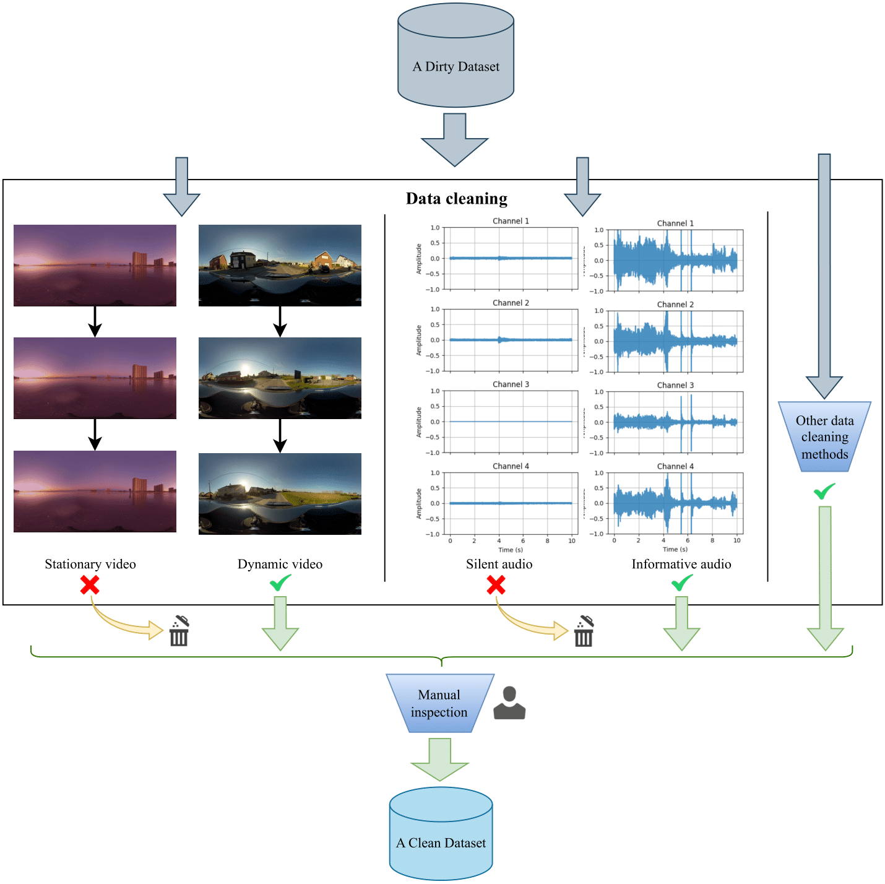

# Data Cleaning

- [Data Cleaning](#data-cleaning)
  - [Silent Filtering](#silent-filtering)
  - [Static Frame Filtering](#static-frame-filtering)
  - [Audio-Visual Matching Filtering](#audio-visual-matching-filtering)
  - [Voice Detection Filtering](#voice-detection-filtering)

## Silent Filtering

**Path:** [toolset/clean/silent/check_new_silent.py](../toolset/crawl/core/download/download_list.py)

**Description:** Filters out audio clips where dBFS remains below -35 for over 90% of the duration. (Parameters are adjustable)

**Usage Instructions:**

1. Modify the input_directory and output_txt_file parameters in [check_new_silent.py](../toolset/crawl/core/download/download_list.py).
2. Run: `python check_new_silent.py`.

## Static Frame Filtering 

**Path:** [toolset/clean/static/check_static_ffmpeg.py](../toolset/crawl/core/download/download_list.py)

**Description:** Samples 2 frames per second. Consecutive frames are converted to grayscale and compared using MSE - frames with MSE <5 are considered static. Videos with over 85% static frames are filtered. (Parameters are adjustable)

**Usage Instructions:**

1. Set the folder_path parameter in [check_static_ffmpeg.py](../toolset/crawl/core/download/download_list.py).
2. Execute: `python check_static_ffmpeg.py`.

## Audio-Visual Matching Filtering

**Path:** [toolset/clean/ImageBind/test.py](../toolset/clean/ImageBind/test.py)

**Description:** Uses [ImageBind](https://github.com/facebookresearch/ImageBind) to evaluate the match between video content and audio.

**Usage Instructions:**

1. Clone the [ImageBind](https://github.com/facebookresearch/ImageBind) repository into `toolset/clean/ImageBind/` and configure python environment.
2. (Optional) Configure CUDA settings in `test.py`.
3. Run: `python test.py`.

## Voice Detection Filtering

**Path:** [toolset/clean/SenseVoice/check_voice.py](../toolset/clean/SenseVoice/check_voice.py), [toolset/clean/SenseVoice/char_count.py](../toolset/clean/SenseVoice/char_count.py)

**Description:** Uses SenseVoice for voice detection and analysis.

**Usage Instructions:**

1. Clone the [SenseVoice](https://github.com/FunAudioLLM/SenseVoice) repository into `toolset/clean/SenseVoice/` and configure python environment.
2. Configure `audio_folder` in [check_voice.py](../toolset/clean/SenseVoice/check_voice.py).
3. Run [check_voice.py](../toolset/clean/SenseVoice/check_voice.py) to output recognized speech text
4. Execute [char_count.py]((../toolset/clean/SenseVoice/char_count.py)) for speech character analysis